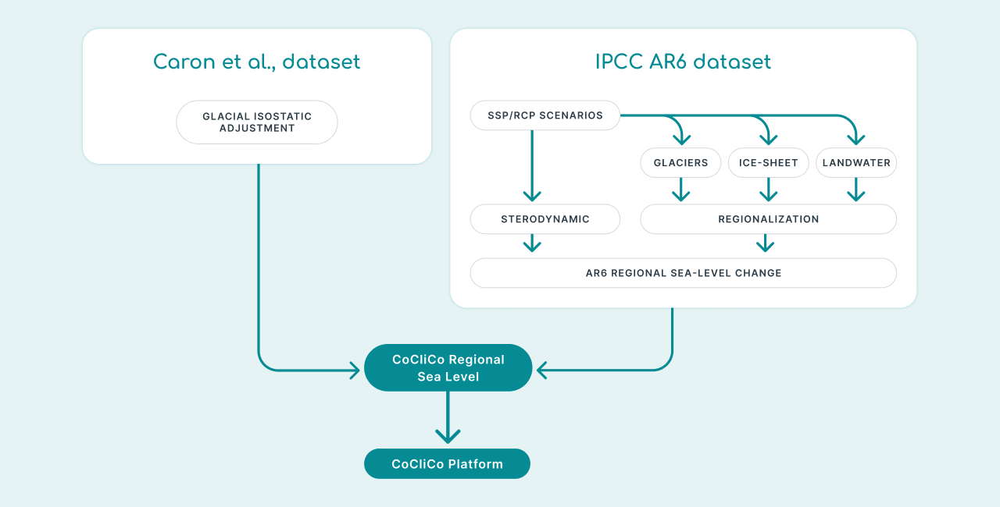
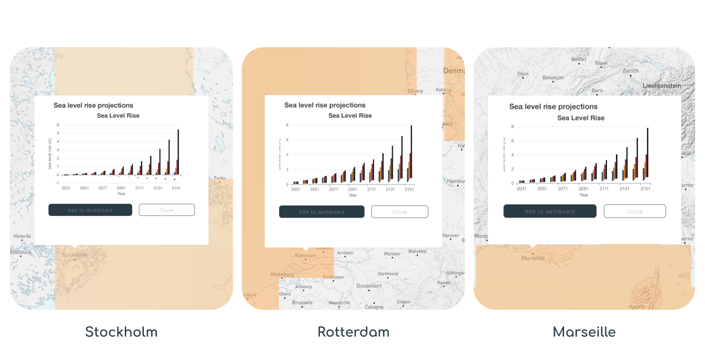
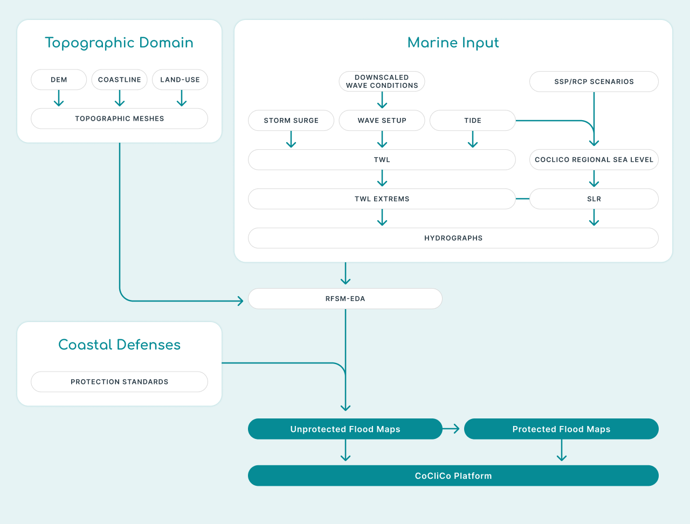
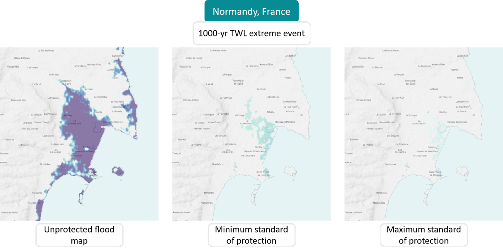
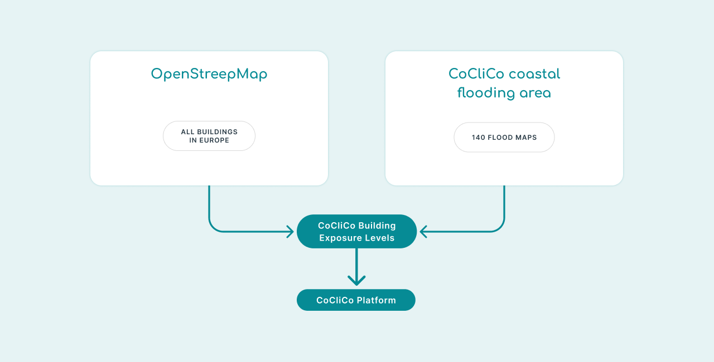
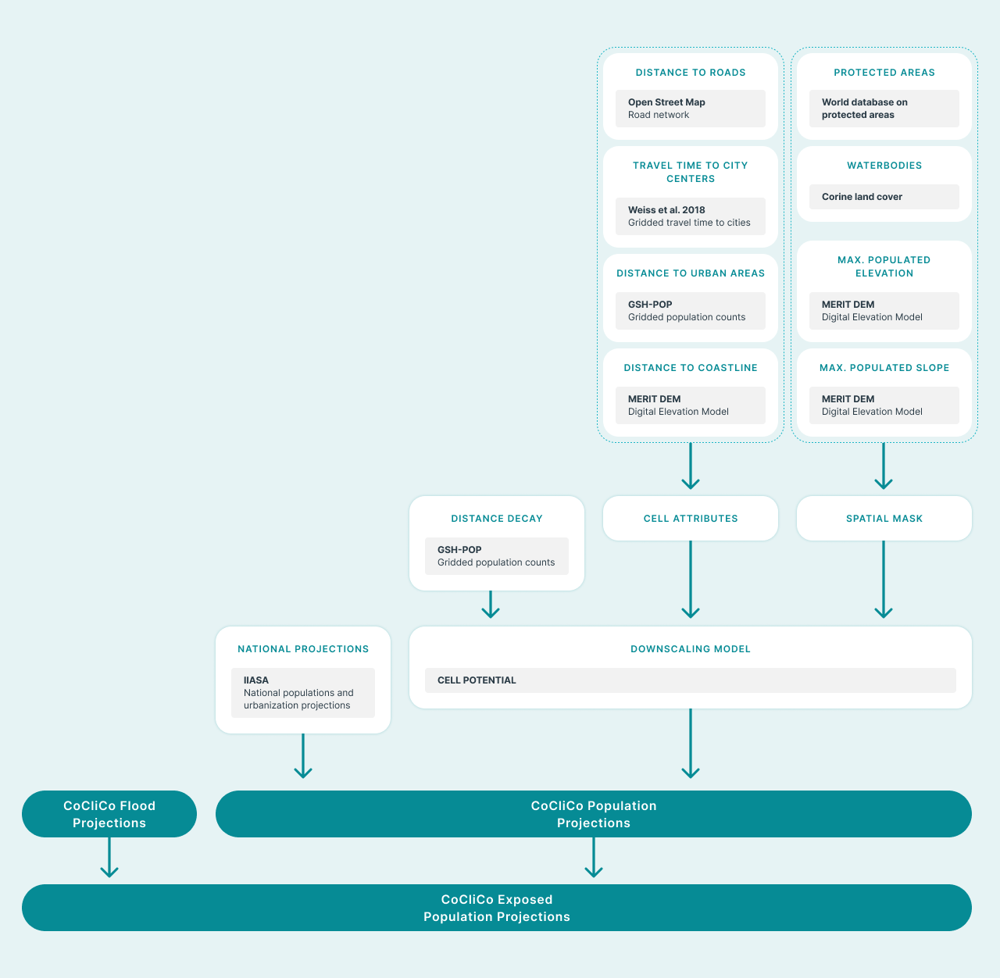
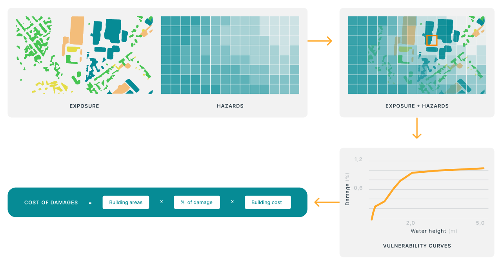
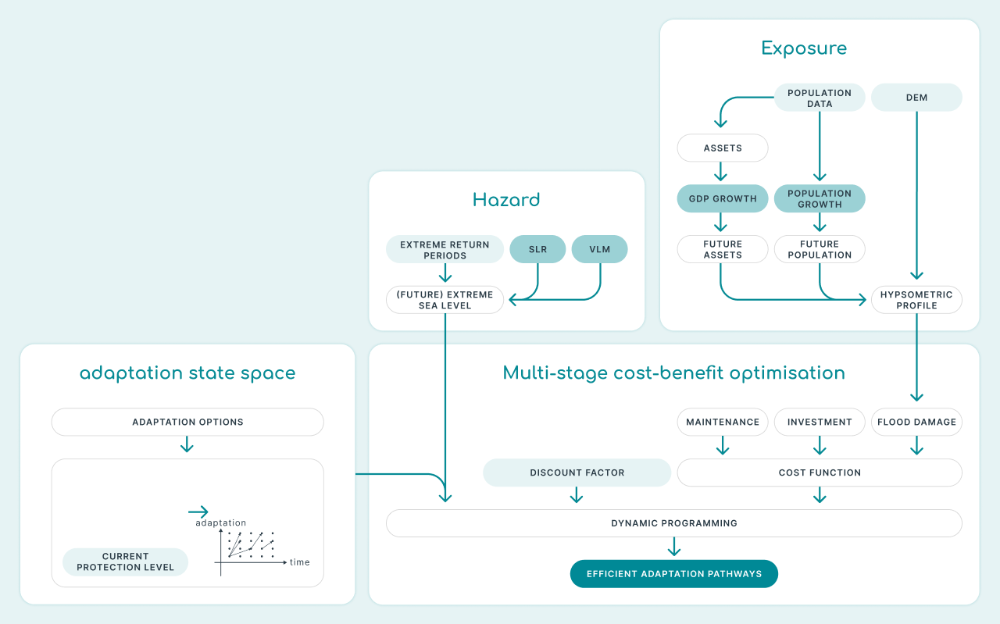

# **Key Layers, Sources, and How to Interpret Them**

## **Data Layers in the CoCliCo platform** 

In the CoCliCo Platform, each data layer is the result of modeling and transforming various datasets from the STAC (SpatioTemporal Asset Catalog) to generate the final geospatial data layers. The platform is organized into five main categories: Sea Levels, Natural Hazards, Exposure and Vulnerability, Risk and Adaptation, and Background Layers, each containing its own specific data layers. Keep reading to discover which datasets are used to create the data layers in the platform.

---

## **User Stories**

User Stories are ready-made map datasets in the CoCliCo platform. They combine different types of important information to show scenarios for coastal risk resulting from sea-level rise,  floods and / or erosion. These layers make complex analyses easier and help users to quickly get a sense of coastal risks.  

User research showed that policymakers need clear, actionable data for flood directives, while urban planners want tools to assess local risks, and where infrastructure managers focus on long-term resilience planning. These insights helped shape User Stories to provide accessible, scenario-driven visualizations for diverse decision-making needs. There are five User Stories: 

1. Inundation distribution during a flood event 
2. Building Exposure 
3. Projections of Exposed People 
4. Damage costs of exposed infrastructures   
5. Adaptation based on cost-benefit analysis 

---

## **Sea Levels**

???+  "Data Layers & User Stories"

    === "Sea Level Rise Projections" 

        
        The **CoCliCo Platform** provides access to **sea-level rise (SLR) projections** based on the latest scientific assessments from the **Intergovernmental Panel on Climate Change (IPCC) Sixth Assessment Report (AR6)**, essential for understanding future changes and planning coastal adaptation. 

        Use the **Sea Level Rise Projections User Story** for detailed insights into how sea levels may change under different climate scenarios. With projections ranging from 0.3 to 1 meter by 2100—and continuing to rise—this data is crucial for assessing coastal flood risks, infrastructure planning, and long-term adaptation.  

        Unlike global estimates, these regional projections account for local factors like ocean circulation, ice melt, and land shifts, offering more precise insights for specific locations. This layer is a key foundation for flood models and supports all other User Stories in the platform. 

        > *"I need to see mean sea-level rise information now and in the future for different climate change scenarios, so I can do a broad-scale preliminary evaluation of risks.”*

        ---

        **Data Sources**

        CoCliCo's regional sea-level projections are based on the IPCC AR6 dataset, incorporating all sea-level components except vertical land motions, which are corrected using GIA model outputs for improved regional accuracy.  

        - IPCC AR6 (Fox-Kemper et al., 2021)  
        - AR6 dataset is described and displayed at [Sea Level Projection Tool – NASA Sea Level Change Portal](https://sealevel.nasa.gov/ipcc-ar6-sea-level-projection-tool) and is publicly distributed at [IPCC AR6 Sea Level Projections](https://zenodo.org/records/6382554) (Garner et al., 2022).  
        - Glacial Isostatic Adjustment (GIA) model outputs (Caron et al., 2018) 

        { width=900 .center}

        ---

        **Methods**

        CoCliCo regional mean sea-level projections are constructed by combining the IPCC AR6 sea-level change dataset and the GIA model outputs of Caron et al. (2018), and propagating uncertainty following a Monte Carlo approach. The regional sea-level changes therefore include the changes in ocean density and circulation, the changes due to continental glaciers and ice-sheet mass loss and their respective regional spatial distribution, changes in land water and groundwater, and the post-glacial rebound.    

        
        **Climate Scenarios**

        The platform offers sea-level rise projections for three **Shared Socioeconomic Pathways (SSPs)** and a **high-end scenario**:

        

        - **SSP1-2.6**  
        *A low-emission scenario where global temperatures are limited to 1.5°C above pre-industrial levels, reflecting a sustainable future with rapid decarbonization.*

        - **SSP2-4.5**  
        *A medium-emission scenario where global temperatures rise moderately, reflecting a future with some efforts to mitigate climate change.*

        - **SSP5-8.5**  
        *A high-emission scenario where global temperatures rise significantly, reflecting a future with continued high greenhouse gas emissions and limited mitigation efforts.*

        - **High-End**  
        *Represents more extreme but plausible outcomes of sea-level rise, useful for risk assessment and worst-case planning.*

        

        ---

        **Ensembles**

        The projections are provided in three **ensemble ranges** to reflect the uncertainty in future sea-level rise:

        - **MSL_h:** Represents the **upper range** of projected sea-level rise, reflecting higher uncertainty and more extreme outcomes.

        - **MSL_m:** Represents the **median projection** of sea-level rise, based on the central estimates from the IPCC AR6.

        - **MSL_l:** Represents the **lower range** of projected sea-level rise, reflecting more optimistic outcomes with lower uncertainty.

        ---

        **Time Horizon**

        The projections are available for **decadal time steps** from **2030 to 2150**, allowing users to explore how sea levels may change over the coming decades and into the next century.

        ---

        **Regional and Global Coverage**

        The projections are provided at both **regional** and **global scales**:

        - **Regional Scale**: Users can explore how sea-level rise may vary across different parts of the world, accounting for local factors such as land subsidence, ocean currents, and glacial isostatic adjustment.
        - **Global Scale**: The platform also provides **global mean sea-level (GMSL) projections**, which represent the average rise in sea levels worldwide.

        ---

        **Baseline Period**

        All projections are relative to a **1995–2014 baseline period**, consistent with the IPCC AR6 methodology. This baseline provides a common reference point for comparing future sea-level rise scenarios.

        ---

        **How to Use the Sea Level Rise Projections**

        - [x]  **Scenario Selection**: Choose from the available scenarios (SSP1-2.6, SSP2-4.5, SSP5-8.5, and high-end) to explore different future pathways of sea-level rise.
        - [x]  **Ensemble Selection**: Select between the high (MSL_h), median (MSL_m), and low (MSL_l) ensembles to understand the range of possible outcomes.
        - [x]  **Time Horizon**: View projections for specific decades (e.g., 2030, 2040, 2050, etc.) to assess how sea levels may change over time.
        - [x]  **Specific Analysis**: Zoom in on specific regions to see how sea-level rise may impact local coastlines.

        ---

        **Model Outputs**

        { width=800 .center}

        ---

        **Why Are These Projections Important?**

        - [x] **Coastal Risk Assessment**: The sea-level rise projections are critical for assessing the risks of coastal flooding, erosion, and other hazards. They help identify areas that may be most vulnerable to future sea-level rise.
        - [x] **Adaptation Planning**: By understanding how sea levels may change in the future, coastal planners and policymakers can develop strategies to protect communities, infrastructure, and ecosystems.
        - [x] **Scientific Consistency**: The projections are based on the latest IPCC AR6 report, ensuring that users have access to the most reliable and up-to-date scientific information.

        ---

        **Example of use**

        > *"Using the Sea Level Rise projections User Stories, city planners identified their neighbourhoods as having a higher risk of permanent flooding related to sea level rise by 2050 under high-emission scenarios high-emission scenarios compared to other neighbourhoods in the country. This analysis informed their decisions to prioritize green infrastructure development in those areas, reducing potential damage costs by 30%."*

        ---

        **Limitations**

        Limitations are twofold: first, vertical ground motions unrelated to the glacial isostatic adjustment are not integrated. Yet CoCliCo’s research has shown that urban areas and populations located in coastal flood plains in Europe (excluding Fennoscandia) are affected by subsidence of approximately 1mm/year in average. 
        
        Second, sea level projections shown here have a resolution of 1°x1°, therefore not taking into account mesoscale ocean processes acting on the continental shelf and within semi-enclosed bassins such as the Mediterranean. Research undertaken by CoCliCo by ENEA and Mercator Ocean (D3.3, soon to be published) suggest that the order of magnitude of the error due to neglecting these processes can reach +/-10cm in Europe. 

        ---

        **Further Analysis**

        Beside GIA, coastal regions in Europe can experience significant vertical land motion (VLM) which can be strong, robust and that can be assessed locally. There is for instance well known subsidence along the Italian Adriatic, the Netherlands or even in more localized shorelines such as the Aksiou delta next to Thessaloniki in Greece. This subsidence context can strongly inflate coastal hazards locally and should therefore be accounted for. The CoCliCo project explored local VLMs using the land vertical velocity estimates from the Copernicus European Ground Motion Service (EGMS) derived over the period 2016-2021 (​​Thiéblemont et al., 2024). While these estimates are not implemented in the regional sea-level projections of CoCliCo, they have been considered for the coastal hazard assessment and can be explored as an exploratory tool using the [Workbench](further_analysis.md).  

    === "Extreme Surge Level"

        The **Extreme Surge Level (SSL) data layer** provides projections of storm surge levels along the European coastline under different climate scenarios. Storm surges are a critical component of coastal hazards, and understanding how they may evolve in the future is essential for coastal risk assessment and adaptation planning. This dataset is part of the **LISCOAST project** and is based on hydrodynamic modeling and climate projections.

        > *"Example"*

        **Data Sources**

        **Methods**

        The SSL projections are based on:

        

        -   :octicons-check-16:{ .lg .middle } __Hydrodynamic Modeling__

            ---

            The **Delft3D-Flow** model was used to simulate storm surge dynamics.

        -   :octicons-check-16:{ .lg .middle } __Climate Forcing__

            ---

            The model was forced by surface wind and atmospheric pressure fields from an **8-member climate model ensemble**.

        -   :octicons-check-16:{ .lg .middle } __Validation__

            ---

            The model was validated using data from **110 tidal gauge stations** across Europe, showing good predictive skill (RMSE: 0.06 m to 0.29 m).

        -   :octicons-check-16:{ .lg .middle } __Extreme Value Analysis__

            ---

            The **Peak-Over-Threshold (POT) method** was applied to estimate SSL values for different return periods.

        

        **Climate Scenarios**

        The dataset includes projections for three climate scenarios:
        

        - **Historical**  
        *Represents the baseline period (1970–2000) for validating the model.*

        - **RCP4.5**  
        *A medium-emission scenario where global temperatures rise moderately.*

        - **RCP8.5**  
        *A high-emission scenario where global temperatures rise significantly.*

        

        ---

        **Return Periods**

        The dataset provides SSL estimates for **eight return periods**, which represent the frequency of extreme events:

        | Return Period (Years) | Description                                                                 |
        |-----------------------|-----------------------------------------------------------------------------|
        | **5**                 | Events expected to occur once every 5 years.                               |
        | **10**                | Events expected to occur once every 10 years.                              |
        | **20**                | Events expected to occur once every 20 years.                              |
        | **50**                | Events expected to occur once every 50 years.                              |
        | **100**               | Events expected to occur once every 100 years.                             |
        | **200**               | Events expected to occur once every 200 years.                             |
        | **500**               | Events expected to occur once every 500 years.                             |
        | **1000**              | Events expected to occur once every 1000 years.                            |

        ---

        **Geographic Coverage**
        The dataset covers the **European coastline**, with detailed projections for:

        

        - **Northern Europe**  
        *Areas north of 50°N, where significant increases in SSL are projected, especially under RCP8.5.*

        - **Southern Europe**  
        *Areas south of 50°N, where minimal changes or small decreases in SSL are projected, except under RCP8.5 towards the end of the century.*

        

        ---

        **How to Use the Extreme Surge Level Data**

        - [x] **Scenario Selection**: Choose from the available scenarios (Historical, RCP4.5, RCP8.5) to explore how storm surge levels may change under different climate futures.
        - [x] **Return Period Selection**: Select a return period (e.g., 5, 10, 20, 50, 100, 200, 500, or 1000 years) to assess the frequency and magnitude of extreme storm surge events.
        - [x] **Geographic Analysis**: Zoom in on specific regions (e.g., Northern or Southern Europe) to see how storm surge levels may vary across the coastline.

        ---

        **Model Outputs**

        ---

        **Why Is This Data Important?**

        - [x] **Coastal Risk Assessment**: The SSL data is critical for assessing the risks of coastal flooding and erosion, especially in areas prone to extreme storm surges.
        - [x] **Adaptation Planning**: By understanding how storm surge levels may change in the future, coastal planners and policymakers can develop strategies to protect communities, infrastructure, and ecosystems.
        - [x] **Combined Effects**: The dataset highlights the combined effects of **relative sea-level rise (RSLR)** and **storm surge levels**, which can significantly increase coastal hazards, particularly under high-emission scenarios like RCP8.5.

        ---

        **Example of use**

        > *"Example"*

        ---

        **Further Analysis**

    === "Extreme Sea Level"

        The **Extreme Sea Level (ESL) data layer** provides projections of total water levels (TWL) along European coastlines under climate change. This dataset combines **mean sea level rise**, **tides**, **storm surges**, and **wave heights** to assess future coastal flood risks. It is part of the **LISCOAST project** and is critical for understanding how climate change will impact coastal hazards.

        > *"Example"*

        ---

        **Data Sources**

        ---

        **Methods**

        **Climate Scenarios**
        The dataset includes projections for two climate scenarios:

        

        - **RCP4.5**  
        *A medium-emission scenario where global temperatures rise moderately.*

        - **RCP8.5**  
        *A high-emission scenario where global temperatures rise significantly.*

        

        ---

        **Return Periods**
        The dataset estimates extreme sea levels for **eight return periods**, representing the frequency of extreme events:

        | Return Period (Years) | Description                                                                 |
        |-----------------------|-----------------------------------------------------------------------------|
        | **5**                 | Events expected once every 5 years.                                        |
        | **10**                | Events expected once every 10 years.                                       |
        | **20**                | Events expected once every 20 years.                                       |
        | **50**                | Events expected once every 50 years.                                       |
        | **100**               | Events expected once every 100 years.                                      |
        | **200**               | Events expected once every 200 years.                                      |
        | **500**               | Events expected once every 500 years.                                      |
        | **1000**              | Events expected once every 1000 years.                                     |

        ---

        **Components of Extreme Sea Levels**

        

        - **Total Water Level (TWL)**  
        *Combines mean sea level (MSL), tides, storm surges, and wave setup.*

        - **Episodic Extreme Water Level (EEWL)**  
        *Includes extreme storm surge levels and wave heights during episodic events (e.g., storms).*

        

        ---

        **Geographic Coverage**
        The dataset covers **Europe’s coastline**, with regional projections highlighting:

        - **North Sea**: Highest projected increase in ESLs (up to 1 m under RCP8.5 by 2100).
        - **Baltic Sea & UK/Ireland Atlantic Coasts**: Significant increases in ESLs.
        - **Southern Europe**: Stable or decreasing extremes, except for Portugal and the Gulf of Cadiz.

        ---

        **How to Use the Extreme Sea Level Data**

        - [x] **Scenario Selection**: Choose between **RCP4.5** (moderate warming) and **RCP8.5** (high warming) to explore future risks.
        - [x] **Return Period Selection**: Select a return period (e.g., 100-year event) to assess the magnitude and frequency of extreme sea levels.
        - [x] **Regional Analysis**: Focus on specific regions (e.g., North Sea, Southern Europe) to understand local impacts.

        ---

        **Model Outputs**

        ---

        **Why Is This Data Important?**

        - [x] **Coastal Flood Risk**: ESL projections help identify areas most vulnerable to flooding, particularly under high-emission scenarios.
        - [x] **Adaptation Planning**: Supports decision-making for coastal defenses, land-use planning, and emergency preparedness.
        - [x] **Combined Effects**: Highlights how **relative sea level rise (RSLR)**, storm surges, and waves interact to amplify risks.

        --- 

        **Example of use**

        > *"Example"* 

        ---

        **Further Analysis**

---
## **Natural Hazards**

???+ "Data Layers & User Stories"

    === "Inundation Distribution During Flood Events"

        The **Inundation Distribution During Flood Events** User Story in the CoCliCo platform helps users understand and prepare for coastal flooding. They are essential for assessing vulnerability, informing risk management strategies, and supporting decision-making for coastal planning, infrastructure protection, and emergency preparedness. These maps show areas at risk of flooding due to rising sea levels, coastal storms, or both. They combine data on land elevation, water movement, and climate predictions to estimate how floods might impact different coastal areas in Europe. This collection of flood maps serves as the basis for other User Stories. 

        > *"I need to see flood extent and depth maps for different relative sea-level rise and storm scenarios so I can assess coastal flood risks and identify vulnerable areas across Europe."*

        ---

        **Data Sources**

        To map flood risks across Europe, we used detailed topographic data to represent the land. This included a high-resolution (25-meter) digital elevation model (DEM) from Copernicus (2019), a defined coastline to set boundary conditions from the European Environment Agency (EEA, 2017), and land-use data from Witjes et al. (2022), which was translated into Manning’s roughness coefficients to estimate how water moves across different surfaces. 

        To understand how ocean forces contribute to flooding, we analyzed water levels at 1 km intervals along the European coast using two approaches. For permanent flooding scenarios, we used data from the CoCliCo Regional Sea Level Rise (SLR) Projections. For temporary flood events, we used extreme total water level (TWL) scenarios based on a reconstructed TWL hindcast. This hindcast included tidal data from the TPXO database, storm surge simulations from the ROMS model (Shchepetkin & McWilliams, 2005), and wave setup estimates based on downscaled wave conditions modeled with WaveWatch III (Tolman, 2009). 

        Finally, we incorporated data on coastal flood protection measures developed by Vrije Universiteit Amsterdam (van Maanen et al., 2024) to improve the accuracy of the flood maps, ensuring they reflect existing defenses along Europe’s coasts. 

        { width=900 .center}

        ---

        **Methods**

        The methodology for mapping coastal flood risks followed three main steps: 

        

        -    __1. Defining the Coastal Floodplain__

            ---

            We identified flood-prone areas as coastal regions between 0 and 15 meters in elevation, hydraulically connected to the sea. These areas were divided into 22 flood units, each with detailed topographic meshes. The meshes consisted of irregular impact zones that followed natural terrain features, with smaller 25-meter impact cells (based on the DEM). Each impact zone was assigned a Manning roughness coefficient based on dominant land use. 

        -   __2. Constructing Flood Scenarios__

            ---

            For permanent flooding, hydrographs were created by combining sea level rise (SLR) projections with the mean spring high tide at each location. For episodic flooding, hydrographs were based on extreme total water level (TWL) analysis and storm duration estimates. The TWL hindcast was reconstructed by summing: 

            - Astronomical tide (TPXO database) 

            - Storm surge (ROMS model) 

            - Wave setup (Stockdon et al., 2006; foreshore slopes from Sunamura, 1984) 

            The peak over threshold (POT) method was used to identify extreme TWL events, estimating return levels with an exponential model. Future flood scenarios combined relative SLR with TWL returns values. 

        -   __3. Running Coastal Flood Simulations__

            ---

            We used the RFSM-EDA 2D flood model (Jamieson et al., 2012) for large-scale flood simulations, incorporating terrain details. The Saint-Venant equations were applied to compute water flow between impact zones, and flood depth was calculated for each 25-meter impact cell. 

            Final flood maps showed depth and extent for different scenarios along the European coast. These maps were post-processed to account for existing coastal defences, considering policy-based protection levels at the provincial level (NUTS 2). 

        

        **Climate Scenarios**

        The dataset includes projections for three climate scenarios:

        

        - **SSP1-2.6**  
        *A low-emission scenario where global temperatures are limited to 1.5°C above pre-industrial levels, reflecting a sustainable future with rapid decarbonization.*

        - **SSP2-4.5**  
        *A medium-emission scenario where global temperatures rise moderately, reflecting a future with some efforts to mitigate climate change.*

        - **SSP5-8.5**  
        *A high-emission scenario where global temperatures rise significantly, reflecting a future with continued high greenhouse gas emissions and limited mitigation efforts.*

        

        **Protection Levels:**

        

        - **High Defended**  
            

            Maximum level of policy-based protection at the NUTS2 level.
        

        - **Low Defended**  
            Minimum level of policy-based protection at the NUTS2 level.

        - **Undefended**  
            Without protection (beyond what may be included in the DEM).

        

        **Flood Drivers:**

        

        - **High tides**  

        - **Frequent storms**  

        - **Extreme “perfect storm” scenario**  

        

        ---

        **How to Use the Inundation Distribution During Flood Events Data**

        - [x] **Defense level**: Choose between high, low, or no protection.
        - [x] **Return Period Selection**: Select a return period (e.g., 100-year event) to assess the magnitude and frequency of the flood event.
        - [x] **Scenario Selection**: Choose between the different climate projections under different Shared Socioeconomic Pathways (SSP126, SSP245, SSP585, High-End).
        - [x] **Timeframe selection**: Available for 2010, 2030, 2050, 2100, and 2150.

        ---

        **Model Outputs**

        Flood maps showing the maximum flood extent and depth for different extreme scenarios (1-year, 100-year, and 1000-year return period TWL events), various relative SLR projections (decadal time steps from 2030 to 2150 relative to the reference period 1995–2014 for three SSP scenarios and one high-end scenario), and the combination of each extreme scenario with every sea level rise scenario.

        { width=800 .center}

        ---

        **Why Is This Data Important?**

        The **Inundation Distribution During Flood Events** dataset is crucial for coastal risk assessment and adaptation planning by:

        - [x] **Supporting flood risk management**: Helps identify vulnerable areas and evaluate different protection strategies.
        - [x] **Informing coastal adaptation**: Aids in designing climate-resilient infrastructure and nature-based solutions.
        - [x] **Enhancing emergency preparedness**: Allows authorities to plan for extreme events and mitigate disaster impacts.
        - [x] **Improving scientific research**: Provides a consistent, large-scale dataset for studying climate change effects on coastal flooding.
        - [x] **Assisting policymakers**: Supports data-driven decision-making for long-term coastal management.

        ---

        **Example of use**

        > *Using the Coastal Flood Maps, a marine conservation group identified several critical wetland areas at risk of being flooded due to storms combined with relative sea-level rise. The group used the flood extent and depth maps for different scenarios to prioritize restoration projects. By focusing on these vulnerable areas, they were able to implement targeted conservation efforts that helped protect the wetlands, preserving biodiversity and improving water quality for the surrounding community.*

        ---

        **Limitations**

        The flood maps provided in the platform offer a robust and homogeneous distribution of flood extent and depth under different scenarios for the coast of Europe considering the spatial variability of its marine dynamics and floodplain characteristics. However, working with large-scale studies entails assumptions and simplifications in order to achieve a homogeneous analysis. As such, the resulting maps provided serve as guidance and should not be used for local-scale interventions and adaptation planning. 

        The maps without defences (undefended maps) provide the upper limit of coastal flooding. The maps with defences (defended maps) provide the lower limit of coastal flooding. Importantly, defended maps should be treated with caution as they assume that the whole province is protected with the same level of protection. 

        **Further Analysis**

    === "Shoreline Change"

        The **Shoreline Change** dataset provides projections of global shoreline evolution under climate change. This assessment considers the combined effects of:

        - **Ambient change**: Historical shoreline trends.
        - **Sea level rise (SLR)**: Based on RCP4.5 and RCP8.5 climate scenarios.
        - **Storm-driven erosion**: Instantaneous shoreline changes due to extreme events.

        > *"Example"*

        ---

        **Data Sources**

        ---

        **Methods**

        **Climate Scenarios**

        The dataset includes projections for two climate scenarios

        

        - **RCP4.5**  
        *A medium-emission scenario where global temperatures rise moderately.*

        - **RCP8.5**  
        *A high-emission scenario where global temperatures rise significantly.*

        

        **Ensembles**

        Data is computed for seven statistical ensembles (1st, 5th, 17th, 50th, 83rd, 95th, and 99th percentiles) at two key timeframes: **2050 and 2100**. The projections stem from the **LISCOAST project**, a comprehensive study of coastal dynamics under climate change.

        ---

        **How to Use the Shoreline Change Data**

        Users can filter the dataset based on:

        - [x] **Scenario Selection**: Choose from the available scenarios (RCP4.5, RCP8.5) to explore how shorelines may change under different climate futures.
        - [x] **Statistical ensembles**: Choose between different confidence levels (e.g., 1st percentile for extreme retreat, 99th for conservative estimates).
        - [x] **Timeframes**: Select a future projections between **2050 and 2100**.

        ---

        **Model Outputs**

        ---

        **Why Is This Data Important?**

        The **Shoreline Change** dataset is critical for:

        - [x] **Coastal risk management**: Identifying areas vulnerable to erosion and planning protective measures.
        - [x] **Infrastructure planning**: Supporting long-term decision-making for sustainable coastal development.
        - [x] **Climate adaptation**: Evaluating potential impacts of sea level rise and storm events.
        - [x] **Scientific research**: Providing a robust dataset for studying coastal responses to climate change.

        **Example of use**

        > *"Example"*

        ---

        **Further Analysis**

---

## **Exposure and Vulnerability**

???+ "Data Layers & User Stories"

    === "Building Exposure"

        The Building Exposure User Story in the CoCliCo platform maps the risk of coastal flooding to buildings in low-lying coastal areas under different climate scenarios. As sea levels rise and extreme weather events become more frequent, understanding which areas are most at risk is crucial for resilience planning and adaptation. 

        This tool combines building data from OpenStreetMap with advanced flood maps, providing policymakers, urban planners, and coastal managers with detailed insights on flood vulnerability. By highlighting localized risks, it supports evidence-based decision-making for long-term coastal adaptation. 

        > *"I need to see building exposure now and in the future for different climate change scenarios, so I can better understand the potential risk hotspots."*

        ---

        **Data Sources**

        The building exposure is based on the latest building information extracted from OpenStreetMap. OpenStreetMap provides a consistent data layer across Europe, with standardized information on building type and location. 

        { width=900 .center}
        ---

        **Methods**

        The building footprints extracted from OpenStreetMap are combined with CoCliCo’s state-of-the-art inundation maps.

        ---

        **How to Use the Building Exposure data**

        ---

        **Model Outputs**

        ---

        **Why Are This Data Important?**
        
        ---

        **Example of use**

        > *"Using the Building Exposure User Stories, city planners identified their neighbourhoods as having a higher risk of flooding related to sea level rise by 2050 under high-emission scenarios high-emission scenarios compared to other neighbourhoods in the country"*

        **Limitations**

        While OpenStreetMap provides a consistent coverage across Europe, it does not provide a complete coverage. Across Europe, the average completeness is estimated to be roughly 70%. Some countries have integrated national-scale databases within OpenStreetMap (e.g. The Netherlands, France & Italy) and are therefore almost complete, other countries have very active user communities that aim for a near-complete data (e.g., Germany). However, some countries still experience several gaps (e.g., Ireland and the United Kingdom). Given the potential of missed buildings, we advise local authorities to careful check, and if possible to re-run the analysis with local information before any decisions are made.

        **Further Analysis**

        The building exposure layer is the starting point for the coastal risk assessment. Moreover, within the [Workbench](further_analysis.md) one can extract exposure data for their area of preference, allowing to better understand how sea-level rise will increase future coastal flood risk within any coastal area across Europe. 

    === "Projections of Exposed People"

        The Projections of Exposed People User Story in the CoCliCo platform shows how many people may be affected by coastal flooding in the future. It combines high-resolution flood and population data to provide clear insights under different climate and socioeconomic scenarios. 

        Since future population growth and movement are uncertain, this tool considers multiple scenarios to improve flood risk assessments. By mapping projected exposure to coastal flooding, it helps policymakers, urban planners, and resilience experts make informed decisions for adaptation and risk reduction.    

        > *"I need information of the development of exposed population in the future for different combinations of climate and socioeconomic scenarios on a regional to national scale, so I can preliminary assess exposure to coastal flooding."*

        ---

        **Data Sources**

        CoCliCo's population projections use IIASA data, downscaled with historical trends and spatial factors like roads, urban areas, and coastline proximity. Areas unsuitable for development, such as steep slopes, water-covered regions, and protected areas, are excluded. These projections are combined with CoCliCo flood data to assess population exposure to coastal flooding. 

        - Based on national population and urbanization projections from IIASA 
        - Downscaled and spatially distributed using historic population data (GHS-POP) 

        Projections account for key geographic and infrastructural influences. Distance to: 

        - Roads (OSM data) 
        - Urban areas (defined by population density, Degree of Urbanization method) 
        - Coastline (MERIT DEM coastal mask) 
        - Urban centers (travel time model by Weiss et al., 2018) 

        Excluded from future population growth 

        - High elevation or steep slopes (MERIT DEM) 
        - Permanently flooded areas (Corine Land Cover) 
        - Protected areas (World Database on Protected Areas) 

        {width=800px .center}

        ---

        **Methods**

        CoCliCo’s population projections are created by using a model (Reimann et al. (2021)) that helps distribute updated national population data from IIASA (2010–2100) in 10-year intervals. The data is broken down at a 1 km resolution for EU countries and the UK, for different Shared Socioeconomic Pathways (SSPs). 

        The model works by first calculating the "potential" or attractiveness of each area (or grid cell). It then distributes population changes over time based on this potential. The "potential" of an area is influenced by factors like how close it is to nearby areas, population density, and distance from the coastline. The model also considers past patterns of people moving between coastal/inland and urban/rural areas, adjusting for two time periods. In addition, urbanization projections are used to account for the different ways urban and rural areas develop over time in each SSP. 

        These population projections are combined with flood projections based on the integrated climate and socioeconomic scenarios to assess how many people are exposed to coastal flooding. The population and flood projections are aligned to ensure they match in both projection and resolution, allowing for accurate calculation of exposed populations at the Local Administrative Units (LAUs) level in coastal areas. These results are then summarized at smaller spatial levels. 

        ---

        **How to Use the Exposed People data**

        ---

        **Model Outputs**

        ---

        **Why Are This Data Important?**
        
        ---

        **Example of use**

        > *"Using the exposed population projections User Story, local authorities identified a concentration of population exposure in a specific area by 2050 under a high sea level scenario and low defence level. This analysis initiated a systematic and targeted adaptation planning process in this area, focusing on enhancing defences to eliminate the population exposure."*

        **Limitations**

        Limitations of the population projections: 

        - **Population Decline:** In areas with population decline, the model treats cell potential differently. In urban areas, higher cell potential is linked to population loss due to suburbanization. In rural areas, lower cell potential is associated with higher population loss. This is a general assumption and might not apply to all EU regions. 
        - **Urban and Rural Definitions:** Urban and rural areas are redefined after each timestep based on urbanization share. However, this measure only reflects the fraction of the population living in urban areas and doesn’t capture the complex structure of urban regions. 

        Limitations of the exposed population: 

        - **Data Alignment:** To combine flood and population projections, both need to have the same resolution and projection. We adjust the population data to match the flood projections, but this can affect population counts. 
        - **Coastline Differences:** The population and flood projections use different coastlines, so some people living near the coast might not be considered at risk, even if they are on the ocean side of the coastline.   

        **Further Analysis**

        To account for the full range of uncertainty in population development and its impact on coastal flooding, it’s useful to explore other socioeconomic scenarios beyond the integrated ones. While these additional estimates aren’t included directly in the platform, they can be explored in the [Workbench](further_analysis.md) by combining various climate and socioeconomic scenarios at different spatial scales.  

    === "Population Projections"

        The Population Projections layer provides projections of population counts and their distribution, at a high spatial level, for different futures of socioeconomic development until 2100. The dataset has been developed based on historical population dynamics and projections of population development at national scale. The future distribution of population is important for assessing potential differences in spatial population development for a range of socioeconomic futures and to see changes in mobility patterns.    

        > *"I need information about the future distribution of population in my region to identify areas of high population concentration for demographic planning."*

        ---

        **Data Sources**

        The population projections downscale the national IIASA population projections (Release 3.1) to a higher spatial level of ~1km resolution based on historical trends and factors such as road networks, urban areas, and coastal proximity. Areas unsuitable for development, such as steep slopes, water-covered regions, and protected areas, are excluded.  

        The national population and urbanization projections from IIASA are downscaled and spatially distributed using historic population data (GHS-POP). 

        Projections account for key geographic and infrastructural influences. Distance to:

        - Roads (OSM data)  
        - Urban areas (defined by population density, Degree of Urbanization method)  
        - Coastline (MERIT DEM coastal mask)  
        - Urban centers (travel time model by Weiss et al., 2018)  

        Excluded from future population growth 

        - High elevation or steep slopes (MERIT DEM) 
        - Permanently flooded areas (Corine Land Cover) 
        - Protected areas (World Database on Protected Areas) 

        ---

        **Methods**

        CoCliCo’s population projections are created by extending the model of Reimann et al. (2021) that helps distribute updated national population data from IIASA (2010–2100) in 10-year intervals. The data are resolved at a 1 km resolution for EU countries and the UK, for different Shared Socioeconomic Pathways (SSPs). 

        The extended model first calculates the "potential" or attractiveness of each area (or grid cell). It then distributes population changes over time based on this potential. The "potential" of an area is influenced by factors such as how close it is to nearby areas, population density, and distance from the coast. The model also considers past patterns of people moving between coastal/inland and urban/rural areas, during two time periods. In addition, urbanization projections are used to account for the different ways urban and rural areas develop over time in each SSP. 

        Socioeconomic scenarios:

        Shared Socioeconomic Pathways (SSP): Five different pathways describing potential socioeconomic futures and their challenges to adaptation and mitigation. Population, urbanization and GDP development have been quantified on a national level. 

        The population dataset includes projections for three SSP: 

        - SSP1: Focus on sustainable development and an open and globalized economy with rapid technological development. Population growth is low and urbanization is high as cities become more attractive. 

        - SSP2: Following recent development trends. Intermediate population growth and urbanization with considerable urban sprawl. 

        - SSP5: Focus on economic growth based on conventional development through fossil fuels. Strong population growth and high urbanization with urban sprawl. 

        ---

        **How to Use the Exposed People data**

        - Scenario Selection: Select a Shared Socioeconomic Pathway (SSP1, SSP2, SSP5) 

        - Timeframe selection: Available for 2010, 2030, 2050, 2100 

        ---

        **Model Outputs**

        Maps of population distribution at ~1km resolution for different Shared Socioeconomic Pathways (SSP1, SSP2, SSP5) and timesteps (2010, 2030, 2050, 2100) for the EU countries and the United Kingdom.  

        ---

        **Why Are This Data Important?**

        The population projections are crucial for accounting for uncertainties in socioeconomic development by depicting a wide range of possible futures in terms of population development. Furthermore, the population projections can be combined with spatial data on hazards to assess exposure and inform adaptation planning.  
        
        ---

        **Example of use**

        > *"County authorities utilized spatial population projections based on different SSPs to anticipate future demographic trends. The projections revealed a consistent pattern across scenarios: population increasingly concentrated in the county town, while rural areas faced ongoing depopulation. Though the intensity of this trend varied by SSP, the insights enabled the county to take proactive, informed action. By leveraging these projections, decision-makers were able to adopt a balanced development strategy that promoted fair and sustainable urban growth without neglecting rural communities. This approach reduced socio-spatial inequalities and ensured that both urban and rural populations received equal protection from coastal hazards."*

        **Further Analysis**

        To account for the full range of uncertainty in population development and associated future exposure to coastal flooding, it’s useful to explore other socioeconomic scenarios beyond the integrated ones. While these additional estimates aren’t included directly in the platform, they can be explored in the Workbench by combining various climate and socioeconomic scenarios at different spatial scales.

    === "Damage Costs of Exposed Infrastructures"

        The Damage Costs of Exposed Infrastructures User Story in the CoCliCo aim at presenting the direct economical impacts of coastal flooding under different climate scenarios. While many coastal infrastructures are protected today, rising sea levels will increase flood extent and depth, leading to higher damage costs without further adaptation. 

        This tool helps policymakers and planners assess these costs at national, regional, and local levels in order to inform adaptation strategies. It combines the latest sea level projections, European flood hazard data, and infrastructure inventories to provide city-scale estimates of future flood damage. 

        > *"I need to quantify damage costs of infrastructures exposed to flooding and assess how it evolves under different climate change scenarios"*

        **Data Sources**

        Damage costs on infrastructures are calculated by crossing hazard, buildings and vulnerability curves.  

        Hazards: Flood maps (water depth) calculated either with or without defences from the CoCliCo project (data producer: IH-Cantabria; available on the CoCliCo STAC Catalog). Flood maps are provided for hindcast, 2030, 2050, 2100 and 2150 for permanent flooding, 1-yr, 100-yr and 1000-yr return period with various SLR scenarios. 

        Exposure: Coastal European Exposure Database (data producer: Institute for Environmental Studies, Vrije Universiteit Amsterdam, available on the CoCliCo STAC Catalog). 11 classes of infrastructures are considered: Building, Power, Wastewater, Telecom, Oil, Gaz, Education, Healthcare, Rail, Road and Water. Infrastructures can be represented as points, lines, polygons or multipolygons. 

        Vulnerability curves: Physical Vulnerability Database for Critical Infrastructure Hazard Risk Assessments. (data producer: Institute for Environmental Studies, Vrije Universiteit Amsterdam, Dataset: Physical Vulnerability Database for Critical Infrastructure Hazard Risk Assessments).The data comes from a study that compiles most of the existing vulnerability curves found in the literature, along with the associated cost. It consists of 102 different vulnerability curves, which depend on the type of infrastructure, and 179 different cost values. The vulnerability curves are used to characterize the percentage of damage to infrastructure based on water height. 

        {width=900px .center}

        **Methods**

        The damage costs are calculated by intersecting hazard (raster) and exposure (polygons) data layers, and vulnerability curves. First, we overlay the coastal flood hazard map with infrastructure data to obtain an average water height for each infrastructure. Then, based on the category of the infrastructure, we apply the corresponding vulnerability curves (e.g. healthcare, education, railway, etc).  

        For the CoCliCo project, we used 18 different vulnerability curves. Once the damage is determined, the associated cost calculation is carried out: the damage cost is the product of the building's surface area, the percentage of damage, and the maximum damage, based on construction costs. 

        **How to Use the Data**

        ---

        **Model Outputs**

        ---

        **Why Is This Data Important?**

        ---

        **Example of use**

        > “National policy makers used the damage costs estimates to get a first order estimate of costs in regions and municipalities and prioritize on adaptation actions and investments in order to maximize the efficiency of public investments in adaptation. While this information can not be used as a single source of information to guide adaptation investments, it provides an element that can be considered together with additional evidence and selection criteria of decision makers”  

    	> “The damage costs estimates at municipal level have been used to identify the potential damage costs in a particular flood plain, allowing to anticipate to what extent existing compensation mechanisms (e.g. insurance) are adequately designed to address loss and damages a now and in the future” 

        ---

        **Limitations**

        One of the main limitations of this method lies in the assumption that infrastructures remain unchanged over time, without considering any construction or destruction of infrastructure. Additionally, the lack of detailed information on certain infrastructures can affect the accuracy of selecting the vulnerability curve, which may lead to variations in the estimated cost. Similarly, the price used is an average price that does not account for specific factors such as the location of the damage or the current local construction costs.  

        ---

        **Further Analysis**

---

## **Risk and Adaptation**

???+ "Data Layers & User Stories"

    === "Cost-Benefit Analysis of Coastal Adaptation"

        The Adaptation based on Cost-Benefit Analysis User Story in the CoCliCo platform helps identify the most cost-effective ways to manage coastal flood risks under different climate scenarios. It evaluates three key adaptation strategies: 

        - Protection – Building coastal defences like seawalls. 
        - Retreat – Relocating people and assets away from flood zones. 
        - Accommodation – Flood-proofing buildings to withstand extreme events. 

        The platform provides country-level insights on the best mix of these strategies, with more detailed local assessments available through the workbench. This helps policymakers and planners make informed, cost-effective adaptation decisions. 

        > *"I want to see economically optimal coastal adaptation options both today and, in the future, as well as the expected investments in coastal adaptation and the potential costs of flood damages"*

        **Data Sources**

        The data flow of the cost-benefit model can be seen in this workflow chart. The output of the model (efficient adaptation pathways in the middle of the Figure) then feed onto the CoCliCo platform. Several parts or even components of this detailed Figure can be excluded to simplify it, e.g. dynamic programming, implementation of adaptation options, etc. The SSP/RCP scenarios inform the sea level rise (SLR) and vertical land motion (VLM) data.

        { width=900 .center}

        **Methods**

        The cost-benefit optimisation integrates several components:  

        - A hazard component to model extreme sea level 
        - An exposure component to assess population and assets at risk 
        - A vulnerability component to assess the susceptibility of assets to hazards 
        - An adaptation state space to outline potential adaptation pathways 
        - Cost functions to estimate the costs associated with adaptation actions 

        The multi-stage cost-benefit optimisation is conducted for each of the 41,327 coastal floodplains individually. We consider a time horizon from 2020 to 2150 with 10-year time steps, a discount rate of 3% and three greenhouse gas emission scenarios: low emissions (SSP1-2.6), high emissions (SSP2-4.5) and very high emissions (SSP5-8.5).  

        **Climate Scenario**

        The dataset includes projections for three climate scenarios:

        

        - **SSP1-2.6**  
        *A low-emission scenario where global temperatures are limited to 1.5°C above pre-industrial levels, reflecting a sustainable future with rapid decarbonization.*

        - **SSP2-4.5**  
        *A medium-emission scenario where global temperatures rise moderately, reflecting a future with some efforts to mitigate climate change.*

        - **SSP5-8.5**  
        *A high-emission scenario where global temperatures rise significantly, reflecting a future with continued high greenhouse gas emissions and limited mitigation efforts.*

        

        **Projections**

        The dataset includes projections up to the years **2050, 2100, and 2150**, offering key metrics to inform decision-making for coastal resilience.

        **Adaptation Strategy**

        

        - **Protection**  
        *Raising coastal defenses.*
        - **Retreat**  
            *Managed withdrawal from vulnerable areas.*
        - **Accommodation**  
            *Implementing flood-proofing measures.*
        - **Protection & Retreat**  
        *A combined strategy where both approaches are efficient.*
        - **No Adaptation**  
        *Areas where adaptation measures are deemed inefficient.*

        

        The analysis accounts for adaptation costs, residual flood damages, and the most cost-efficient adaptation strategies for each floodplain.

        ---

        **How to Use the Data**

        - [x] **Scenario Selection**: Choose from the available scenarios ( RCP4.5, RCP8.5) to explore how Cost-Benefit Analysis may change under different climate futures.
        - [x] **Adaptation Strategy**: Select an adaptation strategy between Protection, Retreat, Accommodation, Protection & Retreat adn No Adaptation
        - [x] **Projection**: Choose between 2050, 2100, or 2150, depending on the timeframe for the adaptation strategy.

        ---

        **Model Outputs**

        - For each coastal floodplain, the model determines the economically optimal adaptation pathway, which is a sequence of adaptation options over time. These adaptation pathways can be explored through the workbench. 

        - The web viewer illustrates the proportion of the coastline where each adaptation option is economically optimal by 2150 for each country, based on the economically optimal coastal adaptation pathways for all 41,327 floodplains. 

        ---

        **Why Is This Data Important?**

        This dataset is crucial for guiding **cost-effective and sustainable coastal adaptation strategies** under different climate change and socioeconomic scenarios. It helps:

        - [x] **Coastal decision-makers** initiate proactive adaptation planning.
        - [x] **Global institutions** estimate future adaptation costs at regional and national scales.
        - [x] **Researchers and policymakers** assess the effectiveness of adaptation pathways over time.

        ---

        **Example of use**

        > *"National policymakers identified that significant funding would be required to address coastal flood risks in various regions. They allocated funding for coastal adaptation, encouraging local authorities to conduct their own research. This approach allowed local governments to assess specific risks and develop tailored solutions, ensuring more effective, region-specific adaptation strategies."*

        ---

        **Limitations**

        This cost-benefit model uses broad data to manage computational limits, which means it doesn't include detailed information about properties, land use, or infrastructure. As a result, the model may be less accurate for specific floodplains. For example, it might suggest retreat as the best adaptation option for an area with a nuclear power plant, but this could present major challenges that the model doesn’t account for. 

        The model also only considers the median sea-level rise (SLR), leaving out high-end SLR scenarios. A sensitivity analysis showed that uncertainties in factors like the discount rate, protection and retreat costs, and protection levels have a bigger impact on the choice of adaptation options, the timing of actions, and total costs than the climate change scenarios themselves.  

        ---

        **Further Analysis**

        Technical users can use the [Workbench](./further_analysis.md) to perform detailed, localized analyses by adjusting variables like flood risks, cost factors, and adaptation options. This allows for tailored assessments of the most cost-effective strategies and the timing of actions at the local scale. 

        Users can explore different sea-level rise scenarios, test adaptation measures, and incorporate local data such as infrastructure details to refine their analysis. The Workbench enables deeper insights, helping inform more precise local adaptation strategies.

    
    
<small>Copyright &copy; 2025 CoCliCo Services</small>

