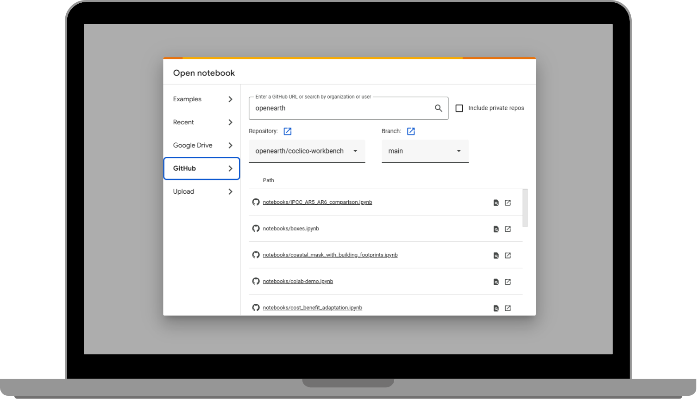
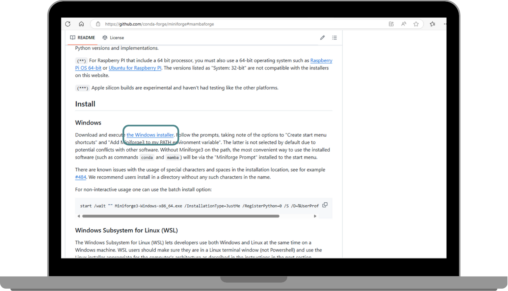
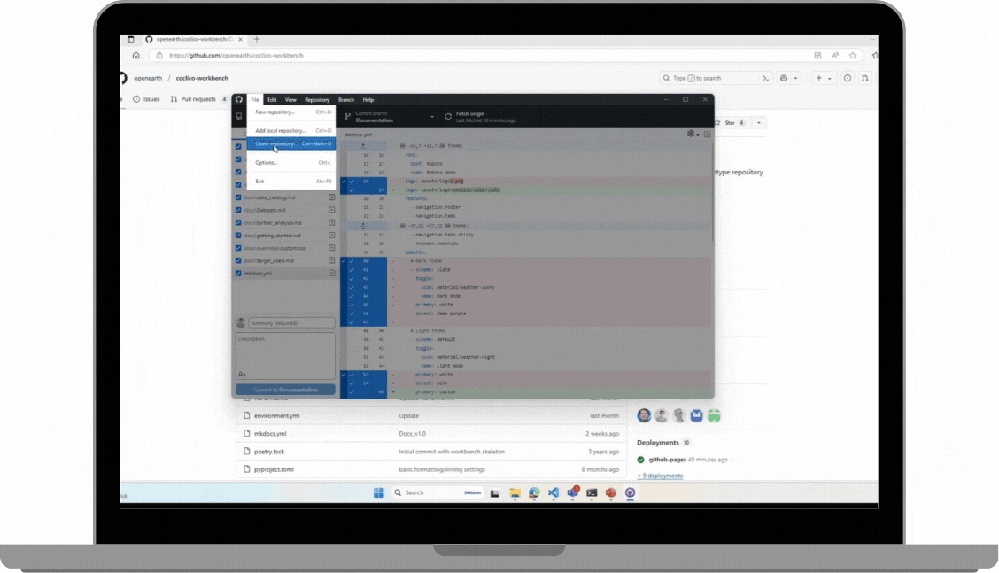
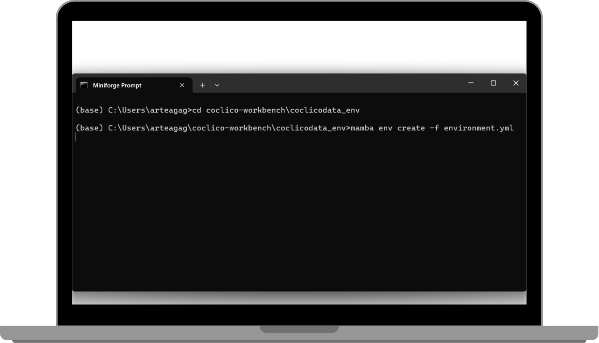
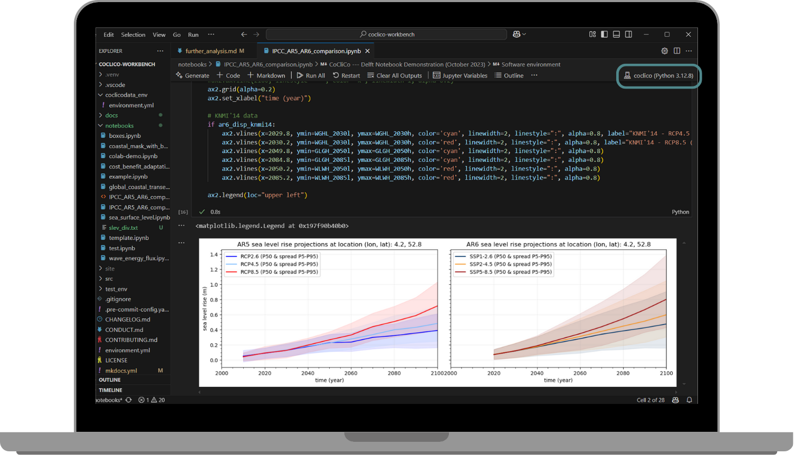

# **Further Analysis with the CoCliCo Workbench**

## **CoCliCo Workbench**
The **CoCliCo Workbench** is a prototype repository containing tutorials and exploratory tools for **Coastal Climate Core Services**. It enables users to conduct in-depth analyses using platform data, either **online** via Google Colab  or **offline** by running the workbench locally.

---

## **Coding Online in Google Colab**

<a href="https://colab.research.google.com/github/openearth/coclico-workbench" target="_blank">  </a>

You can easily explore the Coclico Workbench directly in your browser using [Google Colab](https://colab.research.google.com/github/openearth/coclico-workbench). This allows you to interact with the workbench, experiment with the provided STAT datasets, and test your own ideas. To get started, simply click on the notebook of your choice and dive right in. The workbench is designed to be user-friendly, and with Google Colab, you don't need to worry about any complex setup—just open the link, start testing, and explore the full potential of the datasets.


{ width=900 .center}


---

## **Coding Offline (Locally)**

If running the Coclico Workbench online doesn't suit your needs and you prefer more flexibility, you can clone the repository to your local machine. This will allow you to create your own notebooks, conduct custom analyses, and work offline. You will need to install GitHub Desktop, Mamba Package Manager and VS Code before cloning the repository locally. Once these tools are installed, you can clone the Coclico Workbench repository and start creating your own notebooks and analyses locally. This approach gives you full control over your environment and lets you work with the datasets in a more customized way.

Follow these steps to install and use the **CoCliCo Workbench** locally:

### **1. Install Dependencies**
- Install **GitHub Desktop**: [Download](https://desktop.github.com/)
- Install **Mamba Package Manager** (Miniforge3): [Download](https://github.com/conda-forge/miniforge#mambaforge)

{ width=700 }

### 2. Clone the Repository
- Open GitHub Desktop and **clone the repository**:
  - Click `Add` → `Clone repository` → `URL`
  - Copy the **CoCliCo Workbench URL** from the green **Code** button
  - Set the local path (e.g., `C:\Users\YourName\Documents\GitHub\coclico-workbench`)

{ width=700}


### 3. Set Up the Environment
- Open **Miniforge Prompt** and navigate to the cloned repository:
  ```sh
  cd C:\Users\YourName\Documents\GitHub\coclico-workbench\coclicodata_env
  ```
- Create the software environment (**coclico**):
  ```sh
  mamba env create -f environment.yml
  ```

  { width=700}

- Activate the environment:
  ```sh
  mamba activate coclico
  ```
- Verify the installation:
  ```sh
  mamba list
  ```
- If some **pip dependencies** were not installed, manually install them:
  ```sh
  pip install stactools-geoparquet-items odc-ui odc-stac odc-stats odc-algo odc-io odc-cloud[ASYNC] mapbox mapboxcli xstac
  ```

### 4. Run Jupyter Notebooks in VS Code
- Install **VS Code**: [Download](https://code.visualstudio.com/)
- Open VS Code and **select the cloned repository** as the working directory.
- Open a notebook (e.g., `IPCC_AR5_AR6_comparison.ipynb`) and select the **coclico** kernel in the top right.
- Run cells using `Shift + Enter`.

{ width=900}

---

## **Repository Structure**

The **CoCliCo Workbench** repository is structured as follows:

- **exploratory_tools/**: In-depth user story analysis (e.g., comparisons with high-resolution data, sea-level rise scenarios).
- **notebooks/** *(DEPRECATED)*: Legacy scripts from the early CoCliCo project phase.
- **tutorials/**: Short guides on using the **CoCliCo Data repository (STAC)**.

---

## **License**
The **CoCliCo Workbench** is licensed under the **GNU General Public License**.

---

## **Credits**
The **CoCliCo Workbench** was created using **cookiecutter** and the **py-pkgs-cookiecutter template**.

For any issues, reach out to **@EtienneKras, @mathvansoest, or @FlorisCalkoen**.

---

<div align="center">
    <a href="https://www.openearth.nl/coclico-workbench/">
        
    </a>
    <p><small>Copyright &copy; 2025 CoCliCo Services</small></p>
</div>