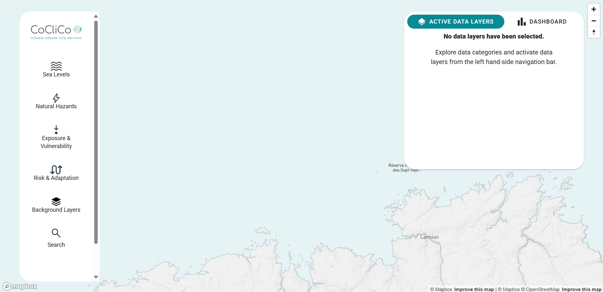
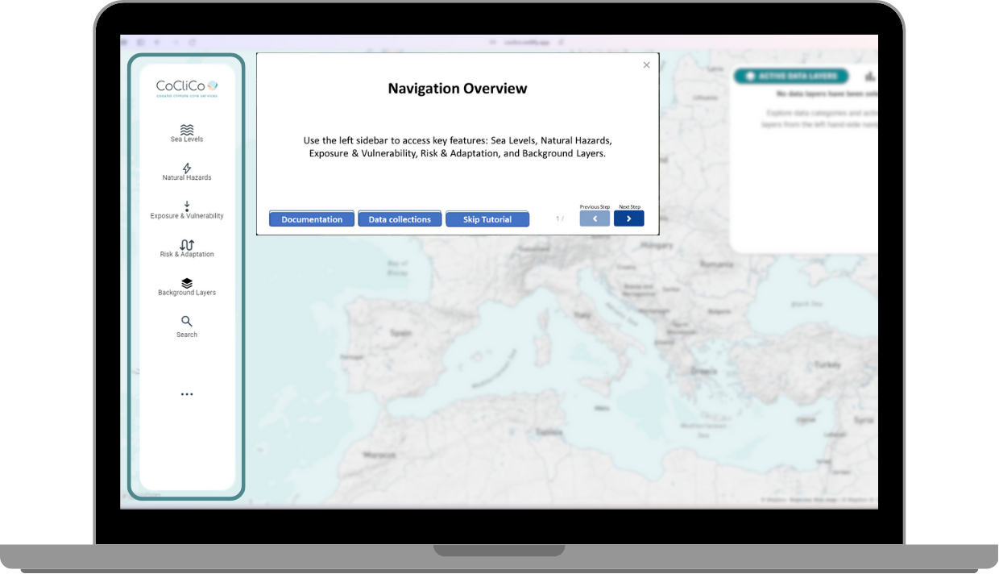
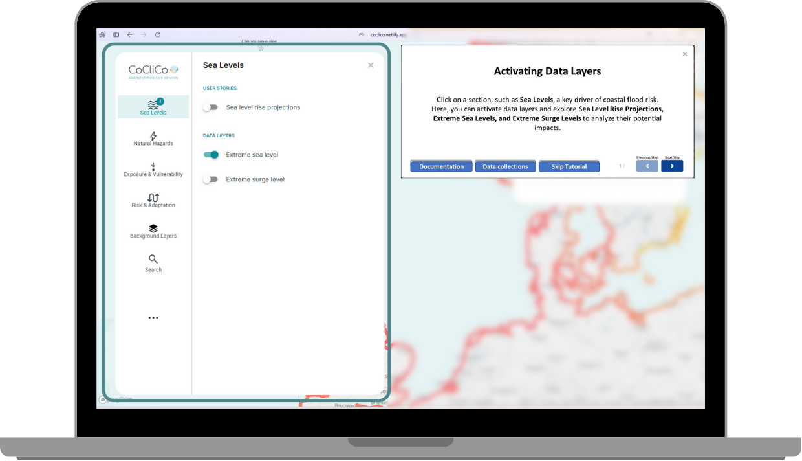
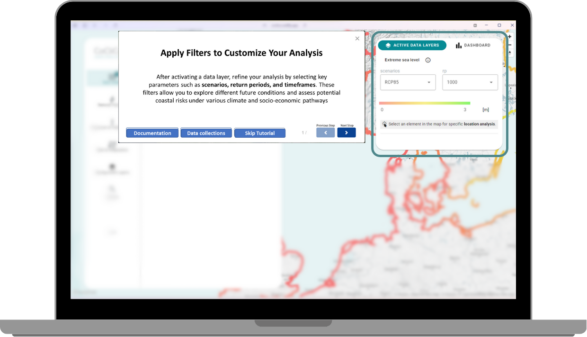
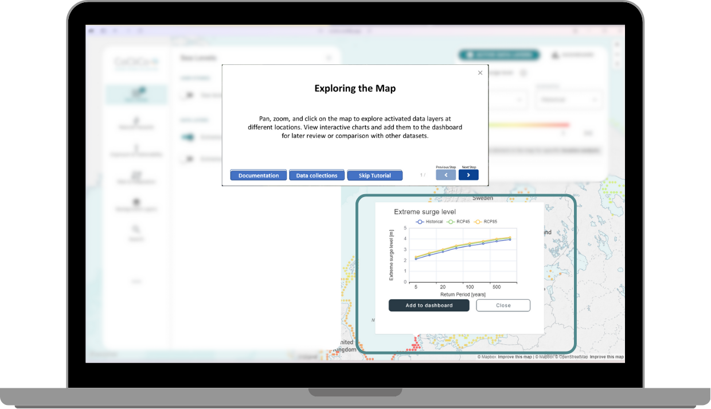
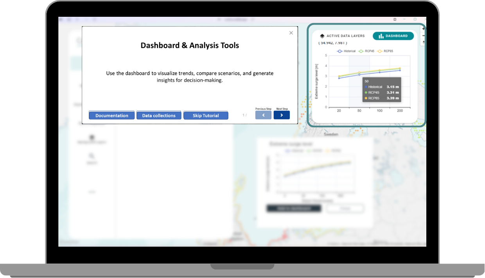

# **How to Begin: A User-Friendly Walkthrough of the Platform**

## **First steps**

Once you've accessed the CoCliCo platform, you'll be greeted with an interactive map and various tools to explore coastal climate data. This section will guide you through the key components of the interface, helping you navigate and use the platform effectively.

---

### **1. Main Interface Overview**

The main interface consists of the following elements:

- **Map Window** – The central area where you can visualize data layers and explore different locations.
- **Sidebar Menu** – Access to datasets and background layers. Click on the layers you want to activate. 
- **Active Data Layers** – Adjust map settings, filters, and toggle visualization options.
- **Dashboard** - Save your analysis and scenarios in the Dashboard window for further analysis and comparison.
- **Interactive Pop-ups** – Click on specific locations to display detailed data insights.

****

### **2. Activate Data Layers**

To bagin your analysis, activate relevant data layers from the Sidebar Menu. These layers include sea level rise projections, coastal hazards, exposure, adaptation strategies and more.

1. Open a category from the **Sidebar Menu**
**** 
2. Toggle the desired layer to display it on the map.

****

### **3. Apply Filters**

The platform allows you to refine your analysis using filters such as return periods, climate scenarios, and hazard thresholds.

1. Go to the **Active Data Layers** window.
2. Choose a **Scenario** (e.g., low-end or high-end sea level rise).
3. Select a **Return Period** (e.g., 10-year, 100-year).
4. The Filters are applied automatically, so go to your **Map Window** and check the changes in the **Data Layer**.

****

### **4. Interact with data**

- **Pan and Zoom** – Navigate across the map using your mouse or touch gestures.
- **Click on a Location** – View detailed data insights through interactive pop-ups.
- **Compare Layers** – Activate multiple layers to analyze overlapping datasets.

****

### **5. Compare**

Users can save and compare results by adding charts into the **Dashboard Window**.

1. Click on a location to open the **insights Pop-up**.
2. Select **Add to Dashboard** to save it for later.
3. Compare different locations in the Dashboard window.

****

---

### **6. Accessing to raw data and examples**

Now that you're familiar with navigating the interface, continue to [Undestanding the Data](Datasets.md) for deeper insights into dataset usage or go to [Further Analysis](further_analysis.md) if you want to create you own experiments with the raw data (Examples included in this section).

---

    
    
<small>Copyright &copy; 2025 CoCliCo Services</small>

